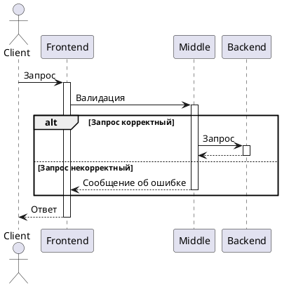

# Мини-банк

        Добро пожаловать в MVP банк с инновационным управлением через Telegram бота!  
    Наше решение предоставляет удобный и безопасный способ управления финансами  
    прямо из мессенджера.  
        С помощью нашего бота вы сможете легко осуществлять платежи, проверять баланс,  
    получать уведомления и многое другое, не покидая чат с друзьями или коллегами.  
    Для начала работы ознакомьтесь с инструкциями ниже и начните пользоваться  
    удобным и инновационным сервисом управления финансами!

### _В данном репозитории хранится модуль middle service мини-банка._

## Структура
- ~~Frontend(telegram-bot на Kotlin)~~
- ### Middle-слой (Java-сервис)
- ~~Backend (Java-сервис)~~

## Стек
- Java
- Spring Boot
- Gradle

## Запуск
- В корневой директории выполнить ./gradlew bootRun

Модуль телеграм-бота можно найти по ссылке 
[Telegram bot](https://github.com/gpb-it-factory/bogdanov-telegram-bot)

## Пример использования

